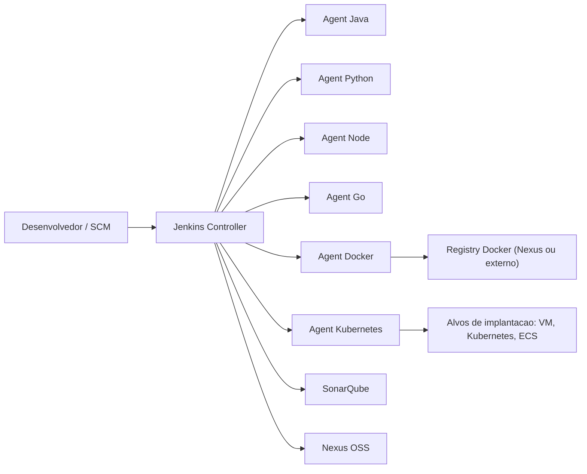

# Arquitetura

## Objetivos

Esta plataforma foi desenhada para entregar:

1. Execucao reproduzivel para Jenkins controller e agents.
2. Inicializacao completa com "configuracao como codigo".
3. Padronizacao de CI/CD para Java, Python, Node, Go e workloads de container.
4. Controles de seguranca e qualidade em todo o fluxo.
5. Caminho claro de evolucao de Docker local para Swarm, Kubernetes e cloud.

## Componentes centrais

1. Jenkins Controller (compatibilidade legada: "master")
2. Jenkins Agents (compatibilidade legada: "workers")
3. SonarQube (perfil opcional)
4. Nexus OSS (perfil opcional)
5. Nginx reverse proxy (perfil opcional)

## Topologia em execucao

## Arquitetura do repositorio

1. `jenkins/`: imagem do controller, JCasC, init scripts, seed jobs e biblioteca compartilhada.
2. `agents/`: imagens por toolchain e alvo de implantacao.
3. `pipelines/`: Jenkinsfiles de CI/CD e modelos de padrao.
4. `examples/`: aplicacoes de exemplo para validacao ponta a ponta.
5. `docs/`: guias operacionais e de seguranca.
6. `scripts/`: inicializacao, verificacoes de saude, backup e restore.

## Perfis de inicializacao

1. Base: apenas controller (padrao).
2. Qualidade: `sonar`.
3. Artefatos: `nexus`.
4. Borda HTTP: `proxy`.
5. Execucao de compilacao: `agents` ou `agent-*`.

## Persistencia de dados

1. `jenkins_home`: estado do Jenkins, jobs, plugins e metadados de compilacao.
2. `sonar_*` + `postgres_data`: estado do SonarQube e banco.
3. `nexus_data`: armazenamento de artefatos e metadados.
4. `agent_*_workdir`: diretorios opcionais isolados por agent.

## Principios de desenho

1. Containers imutaveis para execucao e volumes persistentes apenas onde necessario.
2. Sem configuracao manual obrigatoria via interface para linha base.
3. Separacao clara entre plano de controle (controller) e plano de execucao (agents).
4. Habilitacao por perfis para manter ambiente local leve.
5. Configuracao orientada por variaveis de ambiente com placeholders de segredo.

## Caminho de evolucao para producao

1. Trocar segredos em `.env` por gerenciador de segredos.
2. Publicar Jenkins com TLS via proxy ou ingress.
3. Migrar para agents remotos ou pods dinamicos em Kubernetes.
4. Integrar stack de observabilidade centralizada (logs, metricas e alertas).
5. Adicionar controles policy-as-code para promocao de artefatos e releases.

